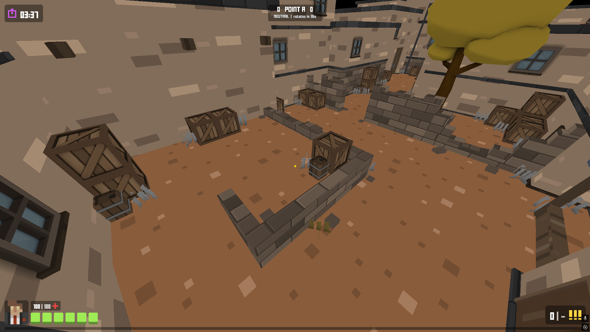

# KrunkNative (Odin)

A Krunker.io Fantasy - A rewrite of the game to target direct binaries. Initially ported into a native-C
implementation, but has been fully ported and removed for the sake of simplicity and ease of development. The entire engine lives in `src/` and is now built
with Odin! 



> [!NOTE]
> The Odin port is actively developed. The client supports offline play and a localhost TCP
> multiplayer path; the network address is currently fixed to `127.0.0.1:21015`.
>
> The native protocol is project-owned and intentionally targets only this native client and
> dedicated server.

## Requirements

- The [Odin compiler](https://odin-lang.org/) and a working system linker.
- A GPU and driver with OpenGL 4.5 core support to run the client. See the
  [GPU compatibility notes](doc/supported-gpus.md) for example hardware families and driver guidance.
- The original game assets described below. The dedicated server does not need the model, texture,
  sound, or font assets.

## Asset setup

The repository includes maps, shaders, configuration, and UI images, but the full runtime asset
pack is not tracked. Before starting the client, unpack a compatible Krunker `mod.zip` into
`assets/` so these paths exist:

- `assets/models/`
- `assets/textures/`
- `assets/sound/`
- `assets/css/fonts/font2.ttf`

A 2020-2021 asset pack is recommended. Keep the files already present in `assets/`; see the
[asset instructions](assets/README.md) for details.

## Building

The port has one build toolchain: **Odin** (`make` is just a thin wrapper). The repository does not
vendor or build separate C dependencies; GLFW, OpenGL, and the image/font loaders come from Odin's
own `vendor/` bindings.

### Linux

On Debian or Ubuntu, install GLFW and its `pkg-config` metadata:

```bash
sudo apt install pkg-config libglfw3 libglfw3-dev
```

Use your distribution's equivalent packages elsewhere. That's the whole build-time dependency list. 

> **Fresh Odin installs only:** Odin ships the STB image/truetype libraries as source, and on
> Linux their prebuilt archives are generated locally. If `odin build` panics with
> *"Could not find the compiled STB libraries"*, run once:
>
> ```bash
> make -C "$(odin root)/vendor/stb/src"
> ```
>
> This needs a C compiler + `ar` (`build-essential` or gcc/clang + binutils).

Then:

```bash
make          # build client and server
make client   # build bin/krunknative_client
make server   # build bin/krunknative_server
make check    # type-check client and server
make test     # build and run the deterministic simulation tests
```

### Windows

No extra libraries are required. Odin's `vendor:glfw` statically links the shipped
`glfw3_mt.lib` (no DLL needed), `vendor:stb` uses pre-shipped `.lib` files, and OpenGL is loaded at
runtime. You only need the Odin compiler and a working Windows linker (MSVC or MinGW-w64).

Build from PowerShell or cmd with the bundled helper. The leading `.\` works in both shells:

```bat
.\build.bat
.\build.bat client
.\build.bat server
.\build.bat tests
.\build.bat check
.\build.bat clean
```

To build the client and server and package them with the minimum curated runtime assets, run:

```powershell
.\package-windows.ps1
```

The packager uses `KrunkNative-Windows.zip` as its asset seed, then adds the current binaries,
configuration, and Famas assets. Use `-SkipBuild` to package existing binaries or `-AssetArchive`
to provide another curated runtime archive.

With no target, the script builds both binaries. The other targets build the client or server,
run the tests, type-check both programs, or remove generated binaries, respectively.

If you ever build the client with `-define:GLFW_SHARED=true`, copy
`vendor/glfw/lib/glfw3.dll` from the directory reported by `odin root` next to the executable.

## Running

Run the binaries from the repository root so every asset path resolves consistently.

### Offline

```bash
./bin/krunknative_client --offline
```

On Windows, use `.\bin\krunknative_client.exe --offline`.

### Local multiplayer

Start the server in one terminal, then start one or more clients from other terminals:

```bash
./bin/krunknative_server
./bin/krunknative_client
```

On Windows, use `.\bin\krunknative_server.exe` and `.\bin\krunknative_client.exe`. With no
`--offline` or `--map` option, the client tries the local server first and falls back to offline
play when the server is unavailable. Passing `--map` always starts a local custom-map session.

### Client options

| Option | Description |
| --- | --- |
| `-m, --map <name>` | Load a specific map, such as `ss_v3`. |
| `-c, --class <name>` | Preselect a class, such as `hunter`. |
| `--offline` | Skip the server connection and run the authoritative simulation locally. |
| `--fps` | Show the FPS meter. |
| `-h, --help` | List every available map and class. |

You can also choose a class on the spawn screen before entering the game.

## Controls

| Input | Action |
| --- | --- |
| `W`, `A`, `S`, `D` | Move |
| Mouse | Look |
| Left mouse button | Fire |
| Right mouse button | Aim or scope |
| `Space` | Jump |
| Left `Shift` | Crouch or slide |
| `R` | Reload |
| `E` / `Q` | Switch to the secondary / melee weapon |
| `Esc` | Release the mouse cursor |
| `F11` | Toggle fullscreen |

## Runtime dependencies (Linux)

- `libglfw3` is the only required runtime library. It pulls in the X11/Wayland/GLX/EGL runtime
  libraries automatically on a desktop.
- For **headless/CI machines or software rendering**, also install `libgl1 libgl1-mesa-dri`
  (the client requests an OpenGL 4.5 core context, which Mesa's `llvmpipe` satisfies).
- OpenGL itself needs no package — the client loads every GL entry point at runtime via GLFW.

## Gameplay configuration

Weapons, classes, and match rules are data-driven from
[`assets/config/game.toml`](assets/config/game.toml). Named sections apply partial overrides over
the built-in defaults:

```toml
[game]
tick_rate = 64
score_limit = 250

[weapons.ak47]
name = "Assault Rifle"
src = "weapon_2"
damage = 23.0

[classes.trooper]
loadout = ["awp"]
```

The same file controls the match timer, objective rotation and scoring, regeneration, respawning,
and player limit. The standard map rotation is `sandstorm`, `undergrowth`, `industry`, and
`evacuation`; all other bundled maps remain available for local play through `--map`. The class
picker uses the standard nine-class pool, while every configured class remains addressable through
`--class` for custom play.

## Testing

The headless test executable exercises the authoritative server path and the client prediction
path against the same fixed-timestep simulation. It covers map collision, gravity, floor and wall
blocking, jump replay, remote interpolation, packet validation, loadouts, weapon timing, damage,
respawning, objective scoring, and all recorded movement scenarios.

```bat
.\build.bat tests
```

The client renderer still requires a GPU and a window; presentation-only behavior should be
verified separately from the deterministic headless suite.

## Project layout

| Path | Contents |
| --- | --- |
| `src/client/` | OpenGL client, UI, audio, input, and client networking |
| `src/server/` | Dedicated authoritative server and TCP networking |
| `src/shared/` | Simulation, maps, configuration, types, and native network protocol |
| `src/tests/` | Server-authority, client-prediction, physics, configuration, and movement tests |
| `assets/` | Maps, shaders, gameplay configuration, and local runtime assets |


## Roadmap

The immediate goal is a functional, playable game state. The roadmap is ordered by dependency;
later phases are intentionally broad and may change as the project and community develop.

### Phase 1: Playable core

- [ ] Implement the competitive Hardpoint ruleset: team assignment, objective activation,
      capture, contesting, scoring, rotation timing, score limits, and tie breakers.
- [ ] Complete the four-site objective cycle and round progression, including best-of-three
      match resolution when enabled.
- [ ] Lock the competitive class pool and match each class's health, speed, regeneration,
      wall-jump ability, hitbox, restrictions, and primary/secondary/melee loadout.
- [ ] Match the native simulation tick order, fixed timestep, movement constants, and speed
      caps for ground movement, air strafing, crouching, sliding, jumping, ladders, ramps,
      wall jumps, bunnyhopping, and jump buffering.
- [ ] Implement the SRM movement state and mechanics: ground/wall frame counters, ramp
      sliding and bounce, dash, wall-dash, cooldowns, direction, height, and velocity rules.
- [ ] Implement every weapon allowed by the competitive ruleset, including exact fire and
      burst cadence, reload/swap timing, ammo, spread, recoil, recovery, falloff, pierce,
      headshots, melee, and projectile behavior. Remove unsupported configurations or finish
      them; Crossbow is currently missing.
- [ ] Match hitbox geometry, map occlusion, team damage, kill attribution, score rewards,
      regeneration, respawn timing, spawn selection, occupancy checks, and spawn protection.
- [ ] Make competitive map collision data exact: ramps, ladders, borders, death zones, walls,
      objective volumes, spawn points, and per-round object reset behavior.
- [ ] Make the simulation deterministic with a fixed timestep, seeded RNG, and explicit update
      order; add replay-vector tests comparing position, velocity, health, ammo, kills, and
      objective state between the authoritative server and predicted client.
- [ ] Add focused edge-case tests for ramps, wall jumps, contested objectives, simultaneous
      kills, reload interruption, projectile/wall impacts, and round transitions.

### Phase 2: Multiplayer foundation

- [ ] Move networking from TCP to UDP using Odin ENet bindings.
- [ ] Preserve authoritative server behavior while handling packet loss, ordering, and reconnects.
- [ ] Profile and optimize the simulation and renderer for larger matches and future content.
- [ ] Replay system for viewing and sharing game sessions.

### Phase 3: Presentation and customization

- [ ] Add basic lighting and improved shaders.
- [ ] Implement more of the live game's customization, specifically the ingame visual settings.
- [ ] Keep content data-driven so new customization does not require gameplay-code changes.

### Phase 4: Extensibility

- [ ] **Exploratory:** investigate an in-game developer console using Odin Lua bindings.
- [ ] Define permissions and build-mode restrictions before exposing scripting in multiplayer.
- [ ] **Exploratory:** A proper map editor.

### Phase 5: Platform and networking experiments

- [ ] **Exploratory:** evaluate macOS support through Odin's Darwin bindings if community interest justifies the maintenance cost.
- [ ] **Exploratory:** investigate GGPO-style peer-to-peer support for private sessions after the simulation is deterministic and rollback-friendly.
- [ ] **Exploratory:** evaluate anti-cheat measures after authoritative networking is stable, starting with server validation, trusted state, and abuse reporting.

### Phase 6: Future content 
- [ ] Ranked ladder / tournament tooling
- [ ] Purely dedicated server binaries the community can run well, themselves.

## Acknowledgements

- [Odin](https://odin-lang.org/) - the language and standard library, including vendor bindings
  for GLFW, OpenGL, and STB
- KrunkNative C version - the original gameplay logic this port mirrors 1:1
- See [the dependency notes](doc/dependencies.md) for how the Odin port replaced the C dependencies
